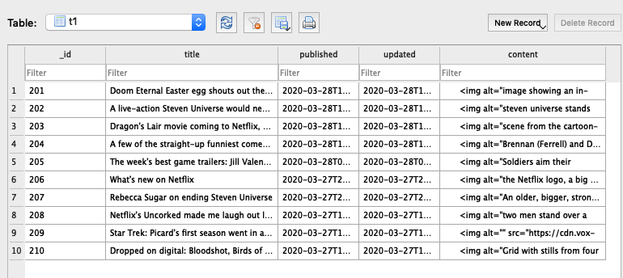
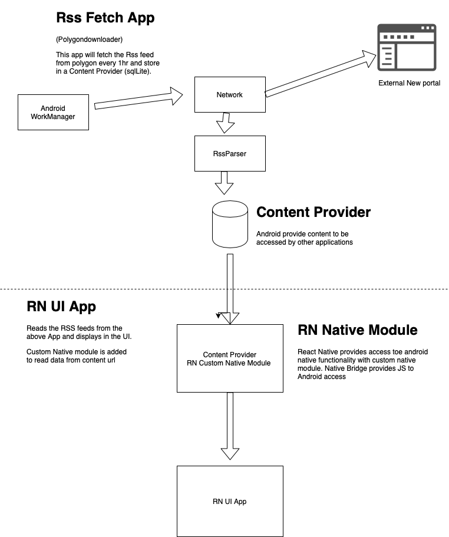

# Section 1

Application B

## Background App (fetch every 1hr)

- Downloads the RSS feeds
- Parse the xml rss feeds
- Store it in sqllite database
- Expose the content using Content Provider

## Tech Stack

- Android App build using **Kotlin**
- Android WorkerManager for background task

## SQLLite table data structure

## Design of the software

